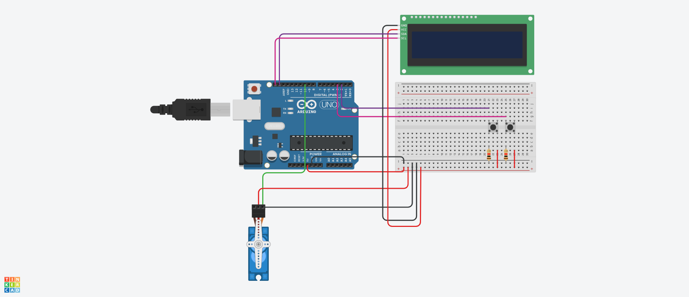

# Blackjack no Arduino

Simulação de uma jogatina de Blackjack (ou 21) no arduino, com possibilidade de jogar Jogador contra Máquina ou Jogador contra Jogador e apostar com fichas.

## Dependências

São necessárias as bibliotecas Servo e LiquidCrystal I2C.
LiquidCrystal I2C pode ser encontrada [aqui](https://github.com/johnrickman/LiquidCrystal_I2C.git).

## Como jogar

Na tela inicial, aperte o Botão A para iniciar uma partida Jogador contra Maquina, ou o Botão B para Jogador contra Jogador.

Independente do modo de jogo, quando for a vez dos respectivos jogadores (exeto a Maquina), aperte o Botão A para comprar uma carta ou Botão B para passar a vez.

Ligue ou desligue o interruptor para ocultar ou mostrar sua mão (bem como a medição do perigômetro).

A vez de cada jogador vai alternando até um deles atingir exatamente 21, ganhando a partida, ou ultrapassando 21, perdendo a partida. Casos os dois jogadores passem a vez consecutivamente, o jogo se encerra e vence quem chegou mais perto de 21. Ambos resultados retornam à tela inicial.

Os jogadores podem depositar, a qualquer momento, suas apostas (fichas) na caixa de arrecadação, as quais no fim da partida serão liberadas e direcionadas ao jogador vencedor.

## Materiais
- Arduino Uno;
- Protoboard (para auxílio);
- 1 Micro Servo 9g;
- LCD 16x2;
- Módulo 12C para LCD;
- 2 botões push;
- Fonte de alimentação;
- Resistores 10k ohm para os botões push;
- Fichas de aposta (qualquer disquinho serve).

## Como montar

Para reproduzir a versão despida do projeto, basta seguir o esquemático: 
Posicione o Servo dispensador de fichas de maneira que empurre sem esforços suas fichas de aposta.
O arquivo do esquemático está presente em "Esquematico.png".

## Arquivos

Blackjack.ino -> código a ser compilado no arduino.
BlackjackLITE.ino -> código a ser compilado no arduino, versão com apenas as funções essenciais e USADA NA VERSÃO FINAL DO PROJETO.
Blackjack.c -> demonstração do código em C.

## Demonstração

[Aqui](https://youtu.be/KD_sZj5_Vy8?si=skKnGZae9wSjmE3Z) está contido o link para o vídeo demonstração no YouTube.

